# 🍔 Food Genie - AI Powered Food Ordering Platform

Food Genie is an **AI-Powered Food Ordering Platform** built using the **MERN Stack** that delivers a personalized food ordering experience through Artificial Intelligence.

The platform enables users to browse restaurants, search and filter food items, securely place orders, make online payments using **Stripe**, receive AI-powered food recommendations, and manage their profiles.

The **Admin Panel** provides complete control over restaurants, food items, orders, users, analytics, and AI-generated food descriptions.

---

# ✨ Features

## 👤 User Module

- User Registration
- Secure Login (JWT Authentication)
- Browse Restaurants
- Search Restaurants
- Filter Restaurants
  - 🥗 Veg
  - 🍗 Non-Veg
  - ⭐ Rating
  - 💰 Budget
- View Restaurant Details
- Browse Food Menu
- Add to Cart
- Buy Now
- AI Review Summary
- Submit Ratings & Reviews
- Profile Management
- Edit Profile
- Order History
- Cash on Delivery (COD)
- Stripe Online Payment
- AI Food Recommendation System

---

## 🤖 AI Recommendation System

Food Genie provides personalized recommendations based on:

- 😊 Mood
- 🥗 Veg / Non-Veg Preference
- 🍕 Food Category
- 💰 Budget
- 📜 Previous Recommendation History

---

# 👨‍💼 Admin Module

## 📊 Dashboard

- Total Users
- Total Restaurants
- Total Food Items
- Total Orders
- Total Revenue

## 📈 Analytics

- Monthly Revenue Analysis
- Monthly Orders Analysis
- Top Performing Restaurants
- Monthly User Registrations

## 🏪 Restaurant Management

- Add Restaurant
- Update Restaurant
- Delete Restaurant

Restaurant Details include:

- Restaurant Name
- Cuisine Type
- Address
- Restaurant Image
- Rating
- Delivery Duration

## 🍔 Food Item Management

- Add Food Items
- Update Food Items
- Delete Food Items
- Assign Food Items to Restaurants

### 🤖 AI Description Generator

Admin can automatically generate attractive food descriptions using Artificial Intelligence.

## 📦 Order Management

Manage Order Status:

- Pending
- Preparing
- Out for Delivery
- Delivered

## 👥 User Management

- View All Users
- Monthly User Registration Analytics

---

# 💻 Tech Stack

## Frontend

- React.js
- HTML5
- CSS3
- JavaScript
- Axios
- React Router

## Backend

- Node.js
- Express.js

## Database

- MongoDB Atlas
- Mongoose

## Authentication

- JWT Authentication
- bcrypt

## AI Integration

- Groq API

## Payment Gateway

- Stripe

## Cloud Storage

- Cloudinary

## Development Tools

- VS Code
- Postman
- Git
- GitHub

---

# 📸 Project Demo

## 🏠 Register Page

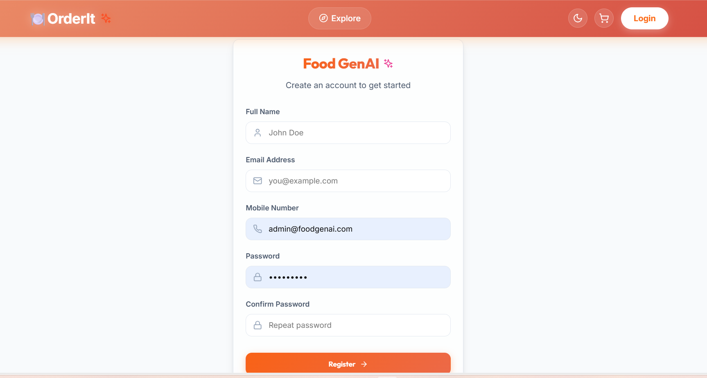

---

## 🔐 Login Page

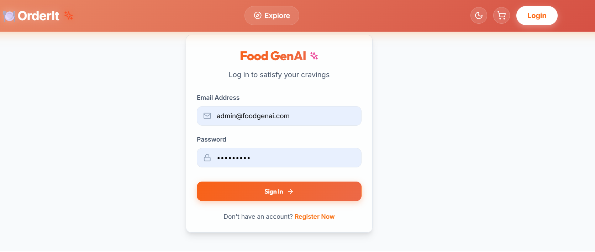

---

## 🍽 Restaurant Dashboard

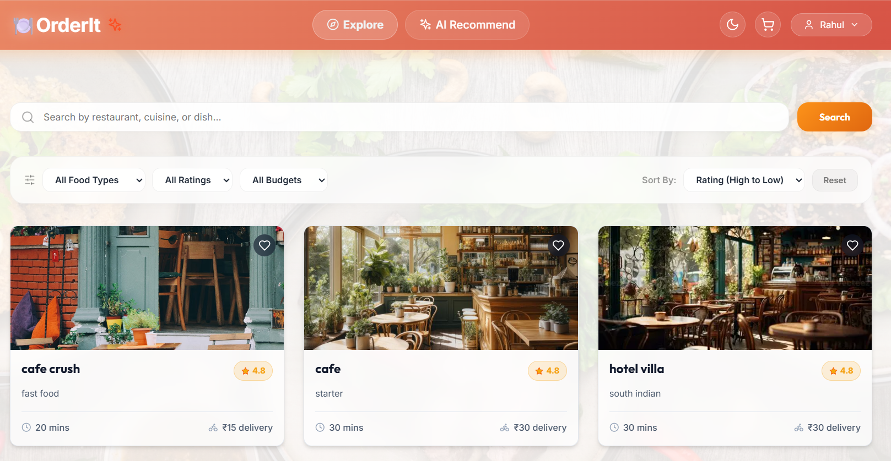

---

## 🍴 Restaurant Menu

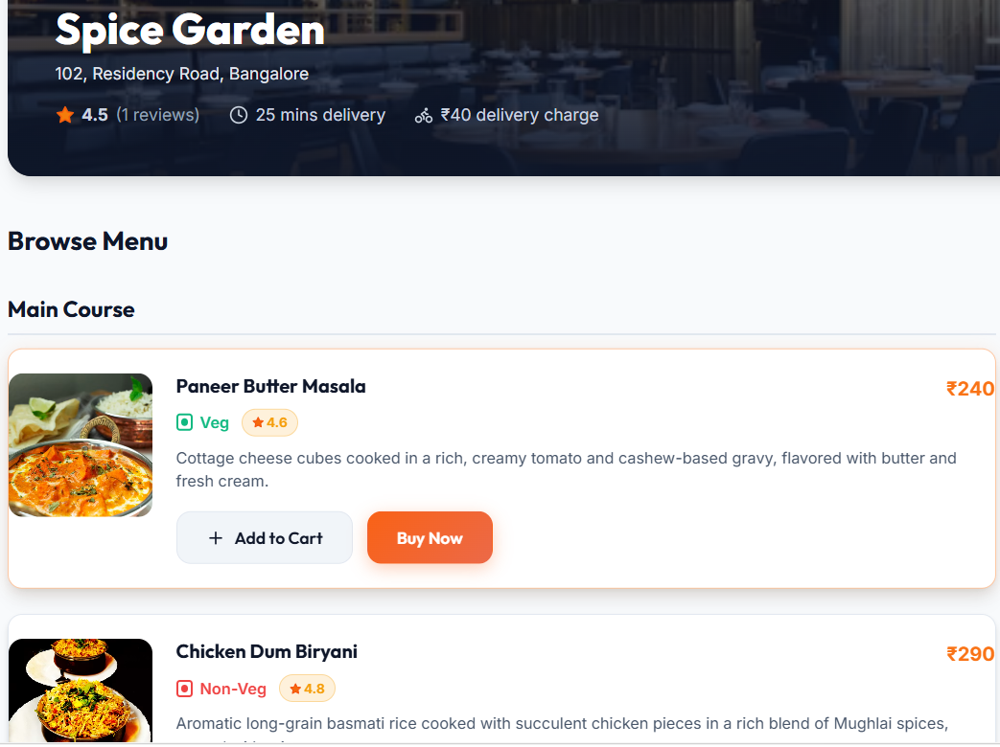

---

## 🛒 Cart

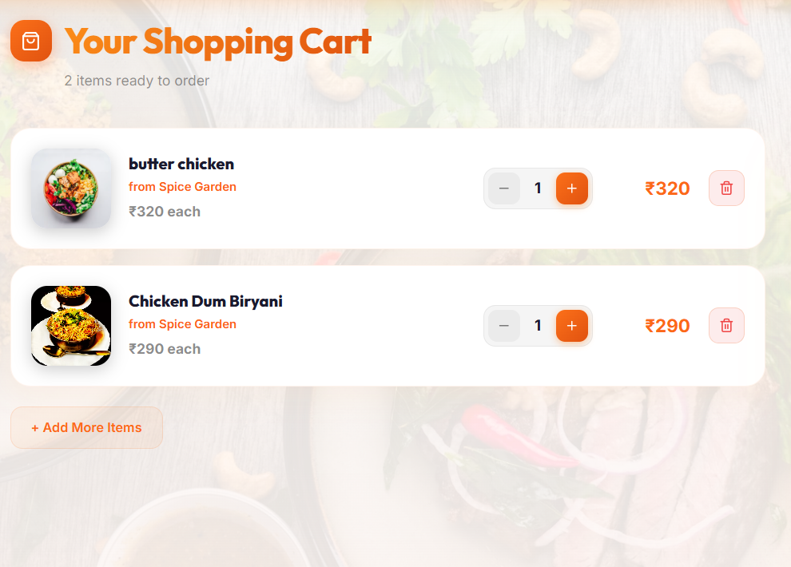

---

## 💳 Stripe Payment

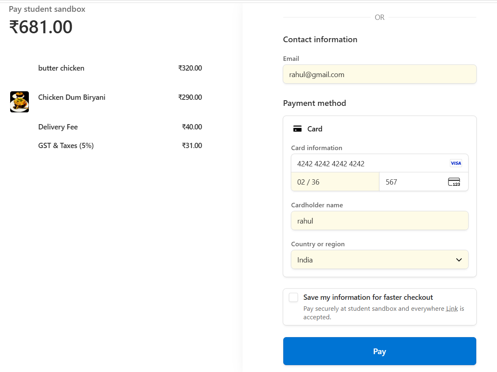

---

## 🤖 AI Recommendation

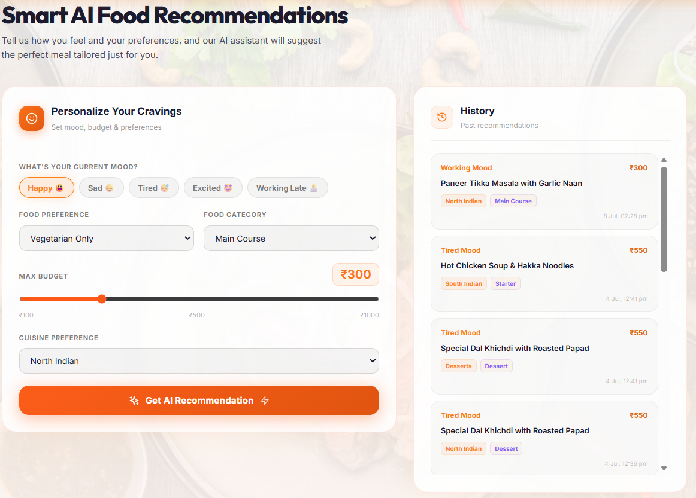

---

## 📜 Order History

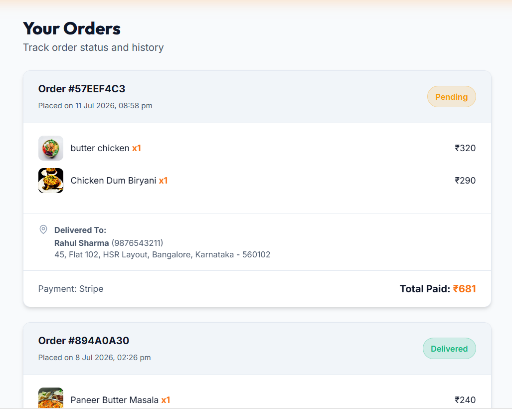

---

## 👨‍💼 Admin Dashboard

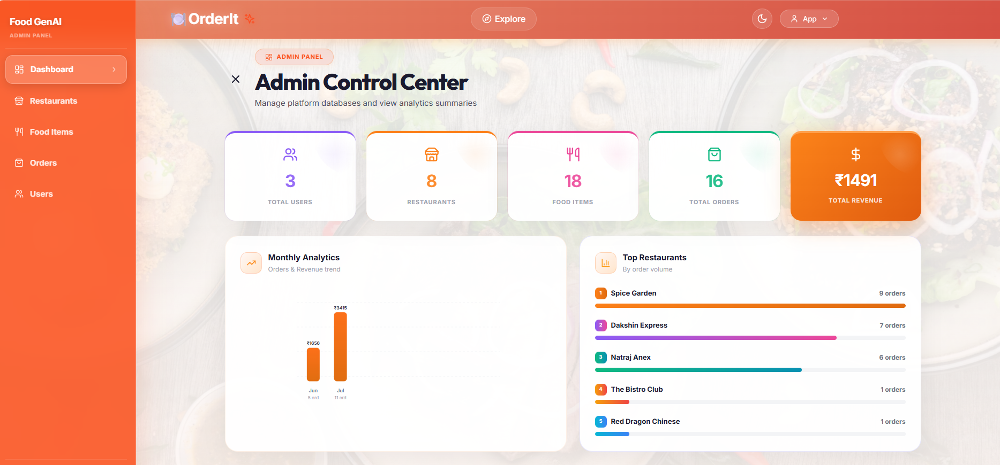

---

## 🏪 Restaurant Management

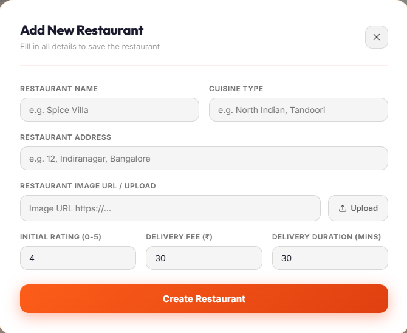

---

## 🍔 Food Management

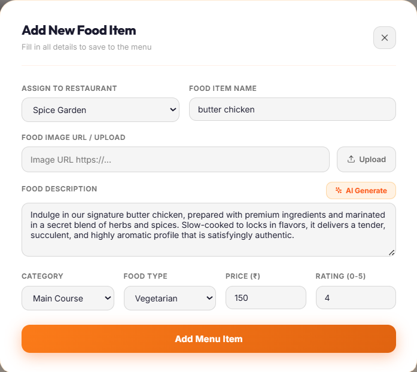

---

## 📦 Order Management

---

# 🚀 Future Enhancements

- Voice-Based Food Ordering
- AI Chatbot Support
- Live Delivery Tracking
- Coupon & Discount System
- Push Notifications
- Multi-language Support
- Mobile Application
- Restaurant Recommendation Engine

---

# 👩‍💻 Developed By

**Jyoti Chavan**

